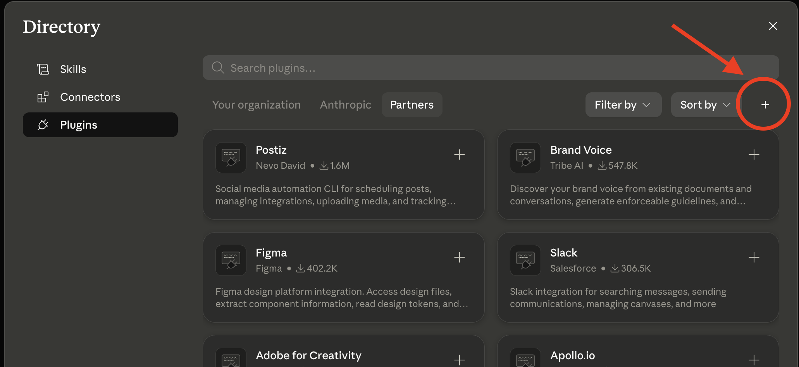
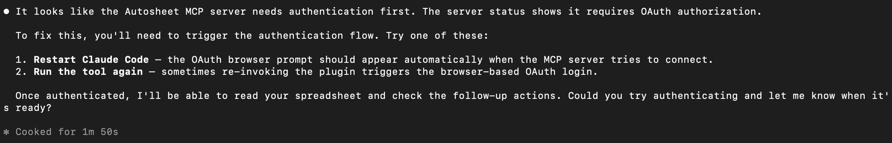

# Autosheet — for Claude, ChatGPT, Claude Code & Codex

The official [Autosheet](https://autosheet.com) plugin: run AI agents against Google Sheets from your AI assistant. The plugin connects your assistant to the hosted Autosheet MCP server and bundles **skills** that teach it when and how to use Autosheet — so it reaches for the right tool, phrases spreadsheet jobs well, and handles long-running agents properly.

## Install the plugin

### Claude Desktop

> **Using Claude in your browser?** Install Autosheet as an [MCP connector](#claude-web--desktop-mcp-only) instead. Installing the plugin in Claude Desktop also does not install it in Claude Code; follow the [separate Claude Code steps](#claude-code) if that is where you want to use it.

1. Open **Claude Desktop**, then go to **Customize → Plugins**
2. Click the small **+** button at the far right of the Plugins screen

   

3. Select **Add marketplace**, enter `run-autosheet/autosheet-mcp`, and sync
4. Find **Autosheet** in the marketplace and click **Install**
5. Start a new chat before using Autosheet for the first time

### ChatGPT (Business & Enterprise)

Plugins are added by a workspace admin. On individual plans, use the [MCP server](#use-the-mcp-server-only) instead.

1. Download the latest `autosheet-plugin-<version>.zip` from [Releases](https://github.com/run-autosheet/autosheet-mcp/releases)
2. Go to [chatgpt.com/admin/plugins](https://chatgpt.com/admin/plugins)
3. Click **Create → Upload plugin** and upload the archive
4. Once added, workspace members can enable **Autosheet**

> **Note:** adding this repository via **Import from GitHub** temporarily fails. Use the upload method above until that is resolved.

### Claude Code

Run these commands inside Claude Code:

```
/plugin marketplace add run-autosheet/autosheet-mcp
/plugin install autosheet@autosheet
```

Then:

1. Start a new Claude Code session so the Autosheet MCP tools are registered
2. Run `/mcp`
3. Select **autosheet** and authenticate; Claude Code opens your browser to complete the OAuth flow
4. Return to Claude Code once Autosheet shows as connected, then submit your spreadsheet request

You do not need to find or paste an OAuth token into your prompt. `/mcp` handles the authentication flow and stores the credentials.

If Claude says that Autosheet requires authentication or that its MCP tools are not registered, stop retrying the spreadsheet request and run `/mcp` first:



### Codex

Requires Node.js 18+ with `npx` available.

```bash
codex plugin marketplace add run-autosheet/autosheet-mcp
codex plugin add autosheet@autosheet
```

Start a new Codex task after installation. The first time you invoke an Autosheet tool, the pinned `mcp-remote` compatibility bridge opens your browser to complete the OAuth flow. The bridge works around [an upstream Codex OAuth regression](https://github.com/openai/codex/issues/31573) and will be removed once Codex handles RFC 9207 issuer parameters correctly.

### Updating the plugin

Claude Code:

```
/plugin marketplace update autosheet
/plugin update autosheet@autosheet
```

Codex (then start a new task so it loads the updated skills and MCP tools):

```bash
codex plugin marketplace upgrade autosheet
codex plugin add autosheet@autosheet
```

## Use the MCP server only

If you can't install the plugin — or you use another MCP-capable client — the hosted MCP server works standalone at `https://mcp.autosheet.com/mcp`. You get the same tools, just without the bundled skills.

### Claude web & desktop (MCP only)

1. Go to **Settings → Connectors → Add custom connector**
2. Enter the URL `https://mcp.autosheet.com/mcp`
3. The first time you use an Autosheet tool, Claude opens your browser to sign in to Autosheet

### ChatGPT

1. Enable developer mode: **Settings → Apps & Connectors → Advanced settings → Developer mode** (on Business/Enterprise, an admin enables connectors instead)
2. Go to **Settings → Apps & Connectors → Create** and add the server URL `https://mcp.autosheet.com/mcp`
3. Sign in to Autosheet when prompted

## Usage

Whichever client you use, just describe what you want done — for example:

```
Score the leads in my Google Sheet against our scoring rules.
```

(In Claude Code you can also type `/autosheet`.)

Provide:

- A **prompt** — what you want the agent to do (e.g. "Fill CEO, headcount, recent news and fit score for every company in column A")
- A **spreadsheet ID or URL** — the Google Sheets document to work on

The agent runs remotely and returns a summary of what it did.

### MCP tools

| Tool | Purpose |
|------|---------|
| `autosheet_run` | Launch an AI agent on a Google Sheets spreadsheet |
| `autosheet_status` | Check the progress of a running agent |
| `autosheet_stop` | Cancel a running agent |

## Issues

Found a bug or have a feature request? Open an issue on this repository. Note that the content of `plugins/` is synced from an upstream repo on each release, so pull requests touching it will be ported upstream rather than merged directly.

## License

[MIT](LICENSE)
