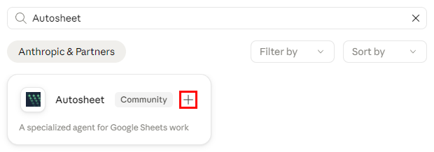
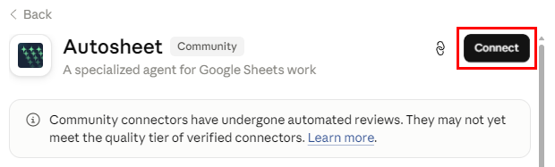
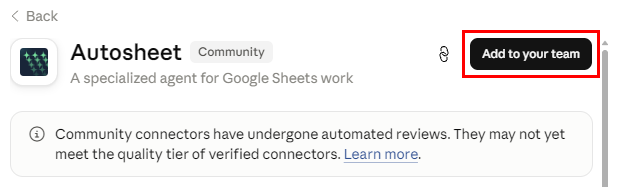
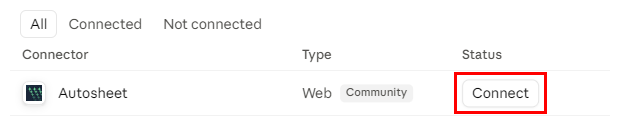

# Autosheet MCP

Autosheet MCP is the hosted remote MCP server for [Autosheet](https://autosheet.com/), the spreadsheet agent that powers [GPT for Sheets](https://gptforwork.com/docs/gpt-for-sheets). The server lets compatible MCP clients run the agent and use direct spreadsheet utilities in your existing spreadsheets.

The server is hosted at:

```text
https://mcp.autosheet.com/mcp
```

You set up Autosheet MCP by connecting directly to the hosted server. This works in every client covered below and gives you [all the Autosheet MCP tools](#mcp-tools).

Dedicated setup instructions are provided for [Claude](#claude), [Claude Code CLI](#claude-code-cli), [ChatGPT](#chatgpt), and [Codex CLI](#codex-cli). You can also use [any other MCP client](#other-compatible-mcp-clients) that supports remote servers over Streamable HTTP with OAuth.

## MCP tools

| Tool | What it does | Inputs |
| --- | --- | --- |
| `autosheet_start_agent_google_sheets_spreadsheet` | Starts a new Autosheet agent on a Google Sheets spreadsheet with your instruction. | `prompt`, `spreadsheet_id` |
| `autosheet_follow_up_agent` | Continues an existing agent conversation with a new instruction. | `prompt`, `agent_id` |
| `autosheet_get_agent` | Reports whether an agent is available or busy, and returns its last-turn messages. | `agent_id`, `wait_seconds` |
| `autosheet_stop_agent` | Stops an agent that is still running. | `agent_id` |
| `autosheet_copy_tab_from_one_spreadsheet_to_another` | Copies one sheet within a spreadsheet or to another spreadsheet without starting an agent. | Required: `source_spreadsheet_id`, `destination_spreadsheet_id`; select the sheet with `sheet_id`, `sheet_name`, or `#gid=` in the source URL |

Notes on the inputs:

- `spreadsheet_id` accepts either a bare Google Sheets ID or a full spreadsheet URL. A sheet ID in the URL sets the sheet the agent starts on.

- `agent_id` identifies an agent that is already running. Your client takes it from the previous result, so you do not need to handle it yourself.

- `wait_seconds` is optional and controls how long a status check waits for the agent before answering: 0 to 50 seconds. The default is 25.

- A follow-up takes no spreadsheet input. It continues on the agent's existing spreadsheet and cannot be pointed at another one. To work on a different spreadsheet, start a new agent.

- `source_spreadsheet_id` and `destination_spreadsheet_id` each accept either a bare Google Sheets spreadsheet ID or a full spreadsheet URL.

- Select the sheet to copy with its numeric `sheet_id`, its exact `sheet_name`, or a `#gid=` in the source URL. Do not provide both `sheet_id` and `sheet_name`. An explicit `sheet_name` takes precedence over `#gid=` in the source URL.

## Get started

### Before you start

To use Autosheet MCP you need:

- **A [GPT for Work](https://gptforwork.com/) account.** You sign in with your Google account. Available usage or credits are required for agent work, but not for the sheet-copy tool. If you do not have a GPT for Work account, the sign-in process automatically creates a free-trial account for you. Once the free trial has ended, [upgrade to a paid plan](https://gptforwork.com/docs/admin/billing/subscription/manage-your-plan) to continue using the spreadsheet agent.

- **Access to the Google Sheets spreadsheets you want Autosheet to work on.** The spreadsheet agent requires edit access. The sheet-copy tool requires read access to the source and edit access to the destination. Autosheet accesses spreadsheets through your Google account.

**Signing in.** Your client authenticates to Autosheet MCP with OAuth. Autosheet opens a browser window for Google sign-in when authentication is required, typically on the first tool call. Your client stores the authentication credentials and reuses them for subsequent tool calls.

> **TIP**
>
> The sign-in process creates an Autosheet API key. The key is how Autosheet MCP identifies you, so the agent can reach the spreadsheets your Google account can edit. You can manage the key in the [GPT for Work dashboard](https://dashboard.gptforwork.com/).

### Claude

Follow the instructions for your Claude account type:

- [Personal account](#claude-personal-account) — Free, Pro, or Max plan

- [Organization account](#claude-organization-account) — Part of a team

#### Claude personal account

To connect Claude to Autosheet MCP:

1. Open Claude in your browser or in the Claude desktop app.

   If you're in the browser, you can go directly to the [Autosheet connector's directory listing](https://claude.ai/directory/connectors/autosheet) and continue from step 7.

1. In the main sidebar, click your user name and select **Settings**.

1. In the settings sidebar, select **Customize > Connectors**.

1. Click **Add > Browse connectors**.

1. Search for `Autosheet`.

1. Click the **+** button for **Autosheet**.

   

1. Click **Connect**.

   

1. Follow the on-screen instructions to authenticate to Autosheet MCP.

You can now [use Autosheet in Claude](#using-autosheet).

#### Claude organization account

An organization owner must first make the Autosheet connector available to organization members. Once the connector is available, members can individually authenticate to Autosheet MCP.

##### Add the Autosheet connector to your Claude organization

If you're an organization owner:

1. Open Claude in your browser or in the Claude desktop app.

1. In the main sidebar, click your user name and select **Organization settings**.

1. In the settings sidebar, select **Libraries & Access > Connectors**.

1. Click **Add > All available**.

1. Search for `Autosheet`.

1. Click the **+** button for **Autosheet**.

   

1. Click **Add to your team**.

   

1. (Optional) To modify the tool permission restrictions for your organization:

   1. Select the **Configuration** tab and click **Connect**.

   1. Follow the on-screen instructions to authenticate to Autosheet MCP.

   1. Check the permission restrictions and adjust them as needed.

The Autosheet connector is now available to your organization members.

##### Connect Claude to Autosheet MCP

If you're an organization member:

1. Open Claude in your browser or in the Claude desktop app.

   If you're in the browser, you can go directly to the [Autosheet connector's directory listing](https://claude.ai/directory/connectors/autosheet), click **Connect**, and continue from step 5.

1. In the main sidebar, click your user name and select **Settings**.

1. In the settings sidebar, select **Customize > Connectors**.

1. Click **Connect** for **Autosheet**.

   

1. Follow the on-screen instructions to authenticate to Autosheet MCP.

1. (Optional) To modify the tool permissions:

   1. In the connectors list, select **Autosheet**.

   1. In the **Tool permissions** section, check the permissions and adjust them as needed.

You can now [use Autosheet in Claude](#using-autosheet).

### Claude Code CLI

> **NOTE**
>
> If you already have [Claude connected to Autosheet MCP](#claude), the Claude Code CLI is also connected — provided you're signed in to the CLI with the same Claude user account. If you cannot or do not want to connect Claude to Autosheet MCP, follow the instructions below for the CLI.

To connect the Claude Code CLI to Autosheet MCP:

1. Open your terminal and run the following command:

   ```bash
   claude mcp add --transport http autosheet https://mcp.autosheet.com/mcp
   ```

   This adds the server for the current project only. To make the server available in all your projects, add `--scope user` to the command:

   ```bash
   claude mcp add --transport http autosheet https://mcp.autosheet.com/mcp --scope user
   ```

1. Start a new Claude Code CLI session.

1. Run `/mcp`, select `autosheet`, and select `Authenticate`. Follow the on-screen instructions to authenticate to Autosheet MCP.

You can now [use Autosheet in the Claude Code CLI](#using-autosheet).

### ChatGPT

Follow the instructions for your ChatGPT account type:

- [Personal account](#chatgpt-personal-account) — Plus or Pro plan

- [Organization account](#chatgpt-organization-account) — Part of a team workspace

#### ChatGPT personal account

You connect ChatGPT to Autosheet MCP by creating a custom plugin. You need to enable developer mode to create and use custom plugins.

> **NOTE**
>
> The Free and Go plans do not support developer mode, so you cannot currently use Autosheet with them.

To connect ChatGPT to Autosheet MCP:

1. Open ChatGPT in your browser.

1. Enable developer mode:

   1. In the main sidebar, click your user name and select **Settings**.

   1. In the settings sidebar, select **Security and login**.

   1. In the **Developer mode** section, enable **Developer mode**.

1. Create the plugin:

   1. In the main sidebar, select **Plugins**.

   1. At the top of the panel, click the **+** button.

   1. Define the plugin settings:

      - **Name**: Enter `Autosheet`.

      - **Connection**: Select **Server URL** and enter `https://mcp.autosheet.com/mcp`.

      - Leave the other settings at their defaults.

      - Check **I understand and want to continue**.

   1. Click **Create**.

   1. Follow the on-screen instructions to authenticate to Autosheet MCP.

You can now [use Autosheet in ChatGPT](#using-autosheet).

#### ChatGPT organization account

A workspace admin or owner must first create and publish a custom app for Autosheet MCP. To create and publish custom apps, developer mode must be enabled. Once the app is published, workspace members can individually install the app and authenticate to Autosheet MCP.

##### Create the Autosheet app for your ChatGPT workspace

If you're a workspace admin or owner:

1. Open ChatGPT in your browser.

1. Enable developer mode:

   1. In the main sidebar, click your user name and select **Settings**.

   1. In the settings sidebar, select **Security and login**.

   1. In the **Developer mode** section, enable **Developer mode**.

1. Create the app:

   1. In the main sidebar, click your user name and select **Workspace settings**.

   1. In the workspace settings sidebar, select **Apps**.

   1. Click **Create**.

   1. Define the app settings:

      - **Name**: Enter `Autosheet`.

      - **Connection**: Select **Server URL** and enter `https://mcp.autosheet.com/mcp`.

      - Leave the other settings at their defaults.

      - Check **I understand and want to continue**.

   1. Click **Create**. The app appears in the **Drafts** tab on the **Apps** page.

1. Publish the app:

   1. Click **Publish** for **Autosheet**.

   1. Select **Review potential risk: Unauthorized data access**, and check **I understand**.

   1. Select **Review potential risk: Malicious app**, and check **I trust this app** and the parameter review statement.

   1. Click **Publish**.

The Autosheet app is now available to your workspace members.

> **NOTE**
>
> If you want to connect ChatGPT to Autosheet MCP for your own account, keep developer mode enabled and follow the instructions below.

##### Connect ChatGPT to Autosheet MCP

> **NOTE**
>
> In the ChatGPT user settings, apps and plugins are both called "plugins".

If you're a workspace member:

1. Open ChatGPT in your browser.

1. In the main sidebar, select **Plugins**.

1. Search for `Autosheet`.

1. Click the **+** button for **Autosheet**.

1. Follow the on-screen instructions to authenticate to Autosheet MCP.

You can now [use Autosheet in ChatGPT](#using-autosheet).

### Codex CLI

To connect the Codex CLI to Autosheet MCP:

1. Open your terminal and run the following command:

   ```bash
   codex mcp add autosheet --url https://mcp.autosheet.com/mcp
   ```

1. Follow the on-screen instructions to authenticate to Autosheet MCP.

You can now [use Autosheet in the Codex CLI](#using-autosheet).

> **TIP**
>
> The above command enables Autosheet for all projects. If you instead want to enable Autosheet only for a specific project:
>
> 1. Open `<project>/.codex/config.toml` in an editor and add the following configuration:
>
>    ```toml
>    [mcp_servers.autosheet]
>    url = "https://mcp.autosheet.com/mcp"
>    ```
>
> 1. Save the file.
>
> 1. Open your terminal, change to the project directory, and run the following command:
>
>    ```bash
>    codex mcp login autosheet
>    ```
>
> 1. Follow the on-screen instructions to authenticate to Autosheet MCP.

### Other compatible MCP clients

Any MCP client that supports remote servers over Streamable HTTP with OAuth can connect to Autosheet MCP. Point it at `https://mcp.autosheet.com/mcp` and complete the browser sign-in when the client prompts you.

Clients other than the ones above have not been tested with Autosheet MCP. Configuration keys, transport names, sign-in commands, and tool permission settings differ between clients, so follow your client's own documentation for the setup steps.

## Using Autosheet

To work on a spreadsheet in Claude, ChatGPT, or another MCP client, start with a prompt where you:

- **Identify which spreadsheet you want to work on.** Provide either the full Google Sheets URL or the bare spreadsheet ID. In a URL, the ID is the part between `/d/` and `/edit`: `https://docs.google.com/spreadsheets/d/<spreadsheet-id>/edit`.

- **Optionally identify which sheet or sheets you want to work on.** You can reference both existing sheets and new sheets you want created, by name. Alternatively, for an existing sheet, you can provide the full Google Sheets URL with the sheet ID included. Copy the URL while the sheet you want is open — the URL looks like `https://docs.google.com/spreadsheets/d/<spreadsheet-id>/edit?gid=<sheet-id>#gid=<sheet-id>`. If you do not identify any sheet, the agent starts working on the first sheet in the spreadsheet. The agent can explore the spreadsheet and move between sheets as the work requires, so the sheet you identify is where the agent begins, not where it is confined.

- **Describe the work you want done in plain language.**

Example prompt:

```text
Here's my spreadsheet:
https://docs.google.com/spreadsheets/d/<spreadsheet-id>/edit?gid=<sheet-id>#gid=<sheet-id>

On the Q3 Pipeline sheet, add a "Risk" column. Flag a deal High if its close date has passed and it's still in Negotiation, Medium if the close date is within 14 days and there's no logged activity, and Low otherwise. Add a one-line reason for each flag.
```

### How Autosheet MCP works

The four agent tools follow the lifecycle below. The sheet-copy tool returns its result directly. It does not use an `agent_id`, polling, progress snapshots, follow-ups, or stop.

Your client passes the instruction, along with the spreadsheet and any sheets you identified, to Autosheet MCP. The spreadsheet agent runs on Autosheet's servers, works through the spreadsheet, and reports back a summary of what it did.

**Starting work.** When you ask for spreadsheet work, your client calls the start tool with your instruction and the spreadsheet. The agent begins working in the spreadsheet. Each new agent starts fresh, with no memory of earlier runs or of your conversation, so the instruction needs to stand on its own.

**Reading the results.** The agent reports a summary of what it did, not the cell contents it wrote. Ask explicitly if you want to see specific values or formulas.

**Following up.** After the agent reports back, you can keep going in the same conversation. Your client calls the follow-up tool, which continues with the same agent rather than starting a new one. Use this for corrections and for work that builds on what the agent just did.

**Stopping.** If the agent is doing the wrong thing, ask your client to stop it. Work already written to the spreadsheet stays there. For more information, see [Important behavior and safe use](#important-behavior-and-safe-use).

Tasks take anywhere from a few seconds to several minutes, and the same instruction may produce different results on different runs. Short tasks finish inside the first call and come straight back. Longer tasks do not hold the call open. The call returns quickly with a progress snapshot, and the agent carries on working on Autosheet's servers. **A snapshot is not a failure.** Your client then polls the status tool until the agent is available and collects the result. The status tool waits a short while for the agent before answering, so polling is cheap. If your client reports work as failed or starts a second agent for the same instruction, that is the client mishandling a snapshot. For more information, see [Troubleshooting](#troubleshooting).

Clients display all of this differently. Tool names, approval prompts, and progress reporting vary, so what you see depends on the client you use.

### What you can do

Autosheet combines a spreadsheet agent with a direct sheet-copy tool. The agent explores the spreadsheet, plans the work, does it, checks its own results, and corrects its mistakes. The agent can also research on the web when the work needs information the spreadsheet does not have. For work the agent cannot do, see [Autosheet limitations](#autosheet-limitations).

#### Copying a sheet

Copy one sheet within the same spreadsheet or into another spreadsheet without starting an agent. The tool keeps values, formulas, formatting, notes, and embedded charts. It appends the copy as the last sheet in the destination. Google gives the new sheet a title that starts with `Copy of ` followed by the original title. References can break when the destination does not contain other sheets that the copied sheet refers to.

```text
Copy the Q3 Pipeline sheet from this spreadsheet: <spreadsheet-url>
Copy it into this spreadsheet: <spreadsheet-url>
```

#### Everyday spreadsheet work

Write formulas, detect and fix errors, format cells, clean up tables, create charts and pivot tables, analyze data.

```text
In <spreadsheet-url>, add a column to the Invoices sheet that flags anything still unpaid more than 30 days after the invoice date, and total the flagged amounts at the bottom.
```

```text
The formula in G2 of <spreadsheet-url> returns #REF!. Explain what it's trying to do, then fix it.
```

```text
In <spreadsheet-url>, format the Budget sheet so headers are bold with a frozen top row, currency columns show two decimals, and anything over budget is highlighted red.
```

```text
The Raw Data sheet in <spreadsheet-url> has blank rows, inconsistent date formats, and numbers stored as text. Clean it up, and restructure the result into one row per order on a new sheet.
```

```text
In <spreadsheet-url>, build a summary of revenue by region and quarter with a chart, on a new sheet called Dashboard.
```

```text
Look at the Sales sheet in <spreadsheet-url> and tell me which regions are trending down over the last four quarters, with a short explanation of what's driving it.
```

#### Row-by-row bulk processing

Clean, translate, categorize, generate, enrich, score, and more, across thousands of rows. For each column the agent fills, it writes one prompt template and uses a subagent to run the template against every row in parallel. This is AI processing per row, not a formula filled down, so it handles work no formula can do: judgment, writing, research, and classification.

```text
The Contacts sheet in <spreadsheet-url> was merged from three sources. Standardize the company names and job titles, flag likely duplicate people in a new column, and normalize all phone numbers to E.164 format.
```

```text
Translate the product descriptions in column D of <spreadsheet-url> into German and French, each into its own new column. Keep brand names in English and stay under 160 characters.
```

```text
Categorize every support ticket in <spreadsheet-url> into one of Billing, Bug, Feature request, or Account access, and put the category in a new column. Flag anything that looks urgent in a second column.
```

```text
For every product in the Catalog sheet of <spreadsheet-url>, write a one-sentence description for the product listing page, in plain concrete language with no superlatives.
```

```text
For every product in <spreadsheet-url>, work out the material, country of origin, and care instructions from the supplier description in column C, and fill them into their own columns.
```

```text
For every company in column A of <spreadsheet-url>, research and fill in the industry, employee count, and headquarters country.
```

```text
Score every lead in <spreadsheet-url> from 1 to 5 on fit for a product that sells to mid-market logistics teams, using the industry and headcount columns, and add a one-line reason next to each score.
```

#### Web research

The agent searches the web and cites its sources, the same as any chat agent. This is separate from the [bulk row-by-row web search above](#row-by-row-bulk-processing), which works at scale but does not report sources.

```text
For each of the five competitors listed in <spreadsheet-url>, find their current entry-level price and add it in a new column, with a source link for each.
```

```text
Research current industry benchmarks for SaaS churn and add them to a new Benchmarks sheet in <spreadsheet-url>, with a source for each figure.
```

## Important behavior and safe use

**Approving tool calls.** MCP clients ask you to approve tool calls before they run. Where that prompt appears, how it is worded, and whether you can pre-approve a tool all vary by client. Tools that can modify a spreadsheet declare themselves as making changes, so clients that act on those declarations will prompt you before running them.

**The agent works directly in your spreadsheet.** It does not work on a copy. Read-only work and bulk row-by-row processing cannot overwrite existing data. Other write operations can add, overwrite, move, or clear content.

**Copying a sheet never overwrites or merges sheets.** The sheet-copy tool always appends a new sheet to the destination spreadsheet, including when the source and destination are the same spreadsheet.

**The agent applies changes by default.** It does not propose a plan and wait for you to accept it. If you want to see the intended approach before anything is written, ask for it explicitly — for example, "plan this first and show me before you change anything". For bulk work, you can ask the agent to do a few rows first so you can check the result before it processes the rest.

**Permissions matter.** The agent works through your Google account and can change anything that account can edit in the spreadsheets you point it at. Check that you are pointing it at the right spreadsheet before you start, particularly with a shared spreadsheet where other people depend on the data.

**Recovering earlier content.** You can review or restore earlier versions of a spreadsheet using Google Sheets version history. Restoring an earlier version also reverts other changes made to the spreadsheet since that version, including changes made by other people. For more information, see [Find what's changed in a file](https://support.google.com/docs/answer/190843) (Google Docs Editors Help).

## Platforms and compatibility

| Client | Tested | Direct connection | Restrictions to know |
| --- | --- | --- | --- |
| Claude | Yes | Yes | Organization accounts: An owner must first make the Autosheet connector available. |
| Claude Code CLI | Yes | Yes | None |
| ChatGPT | Yes | Yes | Developer mode must be enabled for the Autosheet app/plugin creator. Organization accounts: An admin or owner must first make an Autosheet app available. |
| Codex CLI | Yes | Yes | None |
| Other MCP clients | No | Yes, if the client supports Streamable HTTP with OAuth | Untested. Follow your client's own documentation. |

Every client needs Streamable HTTP support and OAuth to connect.

**Tested** means the setup steps in this document have been run on that client and the spreadsheet agent has been confirmed working end to end. **No** means untested rather than incompatible: Any client that supports Streamable HTTP with OAuth should be able to connect, but you will need to work out the setup details from your client's own documentation.

## Autosheet limitations

Autosheet works with existing Google Sheets spreadsheets only. It does not work with local `.xlsx`, `.xls`, `.csv`, or `.tsv` files.

The spreadsheet agent cannot currently:

- Use existing cell colors as input criteria
- Scrape specific URLs, although it can search the web
- Analyze images
- Show its sources for bulk web search
- Record or run a macro
- Run Apps Script or other add-ons
- Export, download, convert, or copy spreadsheet files
- Create new files

The sheet-copy tool copies sheets, not spreadsheet files. See [Copying a sheet](#copying-a-sheet).

## Troubleshooting

**Sign-in fails, or the client says Autosheet needs authentication.** Run your client's sign-in step rather than retrying the spreadsheet request: `/mcp` in the Claude Code CLI, `codex mcp login autosheet` in your terminal. In Claude and ChatGPT, the browser sign-in starts from the first tool call. If sign-in succeeds but the client still reports a problem, start a new session or chat and try again.

**Browser sign-in in a terminal, a remote session, or a headless environment.** Sign-in needs a browser on the machine running the client. In the Codex CLI, `mcp_oauth_callback_port` and `mcp_oauth_callback_url` let you control the callback so it can reach a remote machine.

**Claude cannot reach the server, but your network can.** Remote connectors are brokered from Anthropic's servers, not from your machine. This is true in Claude Desktop and in Cowork as well. A firewall rule or VPN on your own machine is therefore not the cause, and allowing the address locally will not change the result.

**The agent cannot open the spreadsheet.** Check that the Google account you signed in with has edit access to that spreadsheet, and that the spreadsheet has not been moved or deleted.

**The sheet-copy tool cannot write to the destination spreadsheet.** Check that the Google account you signed in with has edit access to the destination spreadsheet.

**The sheet-copy tool cannot read the source spreadsheet.** Check that the Google account you signed in with has read access to the source spreadsheet, and that the spreadsheet has not been moved or deleted.

**The sheet-copy tool cannot find the sheet.** Check that `sheet_id` is the sheet's numeric ID or that `sheet_name` matches the sheet title exactly. You can also copy the source URL while the sheet is open so its `#gid=` selects the sheet.

**A sheet-copy call timed out or its result is unclear.** Check the destination spreadsheet before retrying. The copy may have succeeded despite the timeout, and every call appends a new sheet. Retrying a successful call creates a duplicate.

**Every tool call fails with a Google connection error.** Connecting your client succeeds even when your Autosheet API key has no Google account attached, so the problem only shows up on the first tool call. Connect Google in the [GPT for Work dashboard](https://dashboard.gptforwork.com/), then try again.

**The spreadsheet URL or ID is rejected.** Supply either the full Google Sheets URL or the bare ID. In a URL such as `https://docs.google.com/spreadsheets/d/1etZyGGQPami0R9D2W6WlJMWbrd_JvStLDdsteFegnko/edit`, the ID is the part between `/d/` and `/edit`. Links from other Google products, and shortened links, may not contain the ID.

**The agent worked on the wrong sheet.** Name the sheet in your instruction — that takes precedence over everything else. Otherwise the agent starts on the sheet identified by the sheet ID in the URL you supplied, or on the first sheet if you supplied a bare spreadsheet ID or a URL without one. Copying the URL while the sheet you want is open is the simplest way to get this right.

**A follow-up went to the wrong spreadsheet.** A follow-up always continues on the agent's own spreadsheet and cannot be pointed at a different one. Start a new agent instead.

**A follow-up fails and says the agent has expired.** Agents are kept for a limited time after their last turn. Once an agent expires, follow-ups to it stop working. Start a new agent, and include any context the new agent needs — it has no memory of the earlier run.

**Work is taking a long time.** Longer tasks return a progress snapshot rather than holding the call open, and the agent keeps running on Autosheet's servers. This is normal and is not a failure. Ask your client to check the agent's status rather than repeating the instruction — repeating it starts a second agent on the same spreadsheet, and the two will collide.

**The client reported the work as failed, or started over.** Some clients misread a progress snapshot as an error or a timeout. Check the spreadsheet and ask the client for the agent's status before running anything again.

**The agent did not do what you wanted.** Steer it with a more specific instruction rather than repeating the original one. Ask your client to follow up rather than describing the whole task again — a follow-up keeps the agent's context of what it just did.

**Problems with your client itself.** If your client will not add the connector or plugin, does not pick up its configuration file, does not recognize a command, or does not show the setup screens described here, that is a client-side problem rather than an Autosheet problem. Client interfaces change, so yours may differ from what is described here. Check your client's own documentation.

## Support and policies

- [Contact support](https://support.gptforwork.com/hc/en-us/requests/new)

- [Trust center](https://security.talarian.io)

- [Security and privacy FAQ](https://gptforwork.com/help/get-started/security-privacy-faq)

- [Privacy policy](https://talarian.io/privacy-policy)

- [Terms of service](https://gptforwork.com/terms-of-service)

- [Data processing agreement](https://talarian.io/data-processing-agreement)

- [Pricing](https://gptforwork.com/pricing)

- [Release notes](https://gptforwork.com/help/get-started/release-notes)

To report a security vulnerability, follow the responsible disclosure process on the [Talarian trust center](https://security.talarian.io).

To report a bug in this documentation, open an issue on this repository.

## About this repository

This repository is the canonical documentation for Autosheet MCP.

You do not need anything from this repository to use Autosheet MCP. Connecting a client directly to `https://mcp.autosheet.com/mcp` is enough, and there is no server for you to install or run.

The MCP server source is not in this public repository and is not open source.

## License

[MIT](LICENSE)
