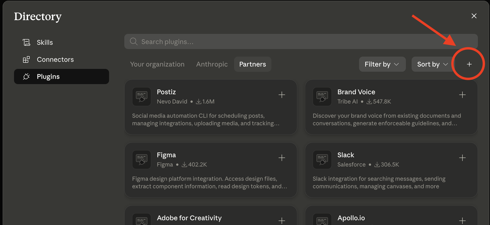
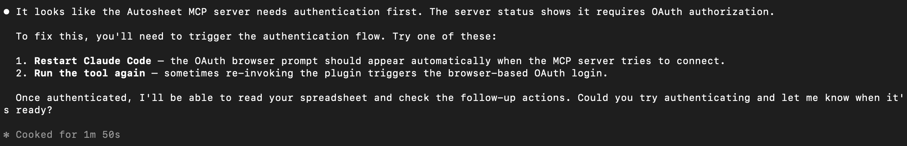

# Autosheet MCP

Autosheet MCP is a hosted remote MCP server. It lets compatible MCP clients run the Autosheet spreadsheet agent directly in your existing Google Sheets spreadsheets. You describe the work in plain language, and the agent carries it out in the spreadsheet.

You do not install or run a server. Autosheet MCP is hosted by Autosheet at a single address:

```text
https://mcp.autosheet.com/mcp
```

The server uses stateless Streamable HTTP transport. Access is authenticated with OAuth. The first time your client calls an Autosheet tool, it opens your browser so you can sign in. Clients can list the available tools before signing in; running one requires sign-in.

There are two ways to set Autosheet up:

- **Connect directly to the hosted server.** This works in every client covered below and gives you the full set of Autosheet tools.
- **Install an optional package from this repository.** Packages are available for some clients. A package can add skills and setup convenience on top of the same hosted server. It does not add tools and does not change what the spreadsheet agent can do.

This repository is the canonical documentation for Autosheet MCP, and it is where the optional packages are distributed from. The MCP server source is not in this repository.

Dedicated setup instructions are provided for Claude, Claude Code, ChatGPT, Codex, and Gemini CLI. Any other MCP client that supports remote servers over Streamable HTTP with OAuth can also connect.

For more about the product, see [autosheet.com](https://autosheet.com/).

## Get started

### Before you start

To use Autosheet MCP you need:

- A GPT for Work account.
- Membership of a GPT for Work space that has usage or credits available. You can be the owner, an admin, or a member of that space. A space is the administrative hub for GPT for Work: it centralizes purchases, billing, usage controls, and API keys for one person or a team. See [Spaces in the GPT for Work documentation](https://gptforwork.com/docs/resources/guides/concepts#space). Usage and credits belong to the space, not to an individual user.
- Edit access to the Google Sheets spreadsheets you want the agent to work on.

**Signing in.** Your client authenticates to Autosheet MCP with OAuth. The first Autosheet tool call opens a browser window for sign-in. After that, your client stores the credentials and reuses them. Separately, the agent works on spreadsheets through your Google account, so it can only reach spreadsheets that your account is allowed to edit.

**Approving tool calls.** MCP clients ask you to approve tool calls before they run. Where that prompt appears, how it is worded, and whether you can pre-approve a tool all vary by client. The tools that start work declare themselves as making changes, so clients that act on that will prompt you before the agent touches a spreadsheet; checking status is declared read-only and is usually not prompted. Keep approval required for the tools that make changes rather than allowing them automatically. See [Important behavior and safe use](#important-behavior-and-safe-use).

**Telling the agent which spreadsheet to use.** Give the agent either the full Google Sheets URL or the bare spreadsheet ID. In a URL such as `https://docs.google.com/spreadsheets/d/SPREADSHEET_ID/edit`, the ID is the part between `/d/` and `/edit`.

**Telling the agent which sheet to work on.** Copy the URL while the sheet you want is open. A Google Sheets URL carries a tab id, such as `#gid=123456`, and the agent starts on that sheet. A bare spreadsheet ID, or a URL without a tab id, starts the agent on the first sheet. Either way, naming a sheet in your instruction takes precedence — for example, "clean up the emails on the Contacts sheet". The agent can explore the spreadsheet and move between sheets as the work requires, so the starting sheet is a starting point rather than a boundary.

### Claude

#### Connect from the Claude Connectors Directory

The Claude Connectors Directory lists connectors you can add without entering a server URL.

> **[TODO — Connectors Directory listing]** Autosheet is not yet listed in the Claude
> Connectors Directory. The listing is pending the connector submission. Until it is
> live, use [Add Autosheet as a custom connector](#add-autosheet-as-a-custom-connector).

To browse the Claude Connectors Directory:

1. Open Claude in your browser or in the Claude desktop app.
2. Select **Customize** in the left sidebar.
3. Select the **Connectors** tab.
4. Select the **+** button.
5. Select **Browse connectors**.

#### Add Autosheet as a custom connector

1. Open Claude in your browser or in the Claude desktop app.
2. Select **Customize** in the left sidebar.
3. Select the **Connectors** tab.
4. Select the **+** button.
5. Select **Add custom connector**.
6. In the name field, enter `Autosheet`.
7. In the URL field, enter `https://mcp.autosheet.com/mcp`.
8. Select **Add**.
9. Start a chat and ask for spreadsheet work. The first Autosheet tool call opens your browser so you can sign in.

<!-- TODO screenshot: Claude's Add custom connector dialog, showing the name and URL fields filled in. -->

On the Claude Free plan you can have one custom connector at a time.

On Team and Enterprise plans, an Owner or Primary Owner has to enable the connector for the organization before members can use it. Each member then signs in individually the first time they use an Autosheet tool.

> **[TODO — Claude Team and Enterprise]** The Owner or Primary Owner enable flow is
> pending verification by someone with the necessary rights.

#### Install the optional package from a custom marketplace

This repository publishes a custom marketplace containing an Autosheet package. The package bundles a skill that helps Claude phrase spreadsheet work well and handle long runs. It connects to the same hosted server as a custom connector does. It is not listed in the Claude Connectors Directory.

Installing the package in the Claude desktop app does not install it in Claude Code. See [Claude Code](#claude-code) if you want it there as well.

1. Open the Claude desktop app.
2. Select **Customize** in the left sidebar.
3. Select the **Plugins** tab.
4. Select the **+** button at the far right.

   

5. Select **Add marketplace**.
6. Enter `run-autosheet/autosheet-mcp` and sync.
7. Find **Autosheet** in the list and select **Install**.
8. Start a new chat before using Autosheet for the first time.

### Claude Code

#### Connect to the hosted server

1. Run this command in your terminal:

   ```bash
   claude mcp add --transport http autosheet https://mcp.autosheet.com/mcp
   ```

   This adds the server for the current project only. Add `--scope user` to make it available in all your projects.

2. Start a new Claude Code session so the server is loaded.
3. Run `/mcp`.
4. Select **autosheet** and choose to authenticate. Claude Code opens your browser to complete the OAuth flow.
5. Return to Claude Code once Autosheet shows as connected, then describe the spreadsheet work you want done.

You do not need to find or paste a token into your prompt. `/mcp` runs the sign-in flow and stores the credentials.

If Claude reports that Autosheet needs authentication, or that its tools are not registered, stop retrying the spreadsheet request and run `/mcp` first:



#### Install the optional package from a custom marketplace

The package bundles a skill on top of the same hosted server. Install it in addition to, or instead of, adding the server with `claude mcp add` — the package supplies its own server configuration.

1. Run this command inside Claude Code:

   ```text
   /plugin marketplace add run-autosheet/autosheet-mcp
   ```

2. Run this command:

   ```text
   /plugin install autosheet@autosheet
   ```

3. Run `/reload-plugins`, or start a new session, so the skill and the Autosheet tools are loaded.
4. Run `/mcp`, select **autosheet**, and authenticate.

With the package installed, you can start spreadsheet work with the `/autosheet` slash command as well as by describing the work in plain language. The slash command comes from the package. It is not available if you only connected to the hosted server.

> **[TODO — slash command name]** Claude Code namespaces package-supplied skills as
> `/<plugin-name>:<skill-name>`, which would make this `/autosheet:autosheet` rather than
> `/autosheet`. The command has not been confirmed against an installed package. Verify
> which form is correct before publication.

To update the package later, refresh the marketplace and reload:

```text
/plugin marketplace update autosheet
/reload-plugins
```

### ChatGPT

#### What ChatGPT plans can do

The Autosheet spreadsheet agent applies changes to your spreadsheets. That is a write action.

**On individual ChatGPT plans, custom MCP connectors are read-only, even with developer mode enabled.** This has been confirmed by testing. A direct custom connector on an individual plan can connect to Autosheet MCP and sign in, but it cannot perform the spreadsheet work Autosheet exists to do. Write actions are available only in Business, Enterprise, and Education workspaces.

If you are on an individual plan and need the agent to change spreadsheets, use one of the other clients in this guide.

#### Add Autosheet as a custom connector

Developer mode is available on the web for Pro, Plus, Business, Enterprise, and Education accounts. The ChatGPT interface calls these items **plugins**.

1. Open ChatGPT in your browser.
2. Go to **Settings → Security and login**.
3. Turn on **Developer mode**.

   <!-- TODO screenshot: ChatGPT Settings > Security and login, with the Developer mode toggle. -->

4. Create a custom plugin and enter the server URL `https://mcp.autosheet.com/mcp`.
5. Sign in to Autosheet when prompted.

A custom personal plugin is visible in the Plugins interface once developer mode is enabled. Plugins can be public or personal.

> **[TODO — ChatGPT personal plugins]** Two things are unresolved here. The interface
> path for creating the custom plugin in step 4 is not confirmed, so the step does not
> name a menu. And it is not known whether a custom personal plugin is subject to the
> same read-only restriction as a custom connector on individual plans. Neither has been
> tested.

#### Import the optional package (Business, Enterprise, and Education)

A workspace admin imports the package. Once imported, workspace members can enable it.

1. Go to [chatgpt.com/admin/plugins](https://chatgpt.com/admin/plugins).
2. Select **Create → Import from GitHub**.
3. Enter the source `https://github.com/run-autosheet/autosheet-mcp`, the branch `main`, and the sparse path `plugins/autosheet`.
4. Select **Import from GitHub**.
5. Once the import finishes, workspace members can enable **Autosheet**.

> **[TODO — ChatGPT import path]** This admin import path is pending verification by
> someone with workspace admin rights.

### Codex

The Codex CLI and the Codex IDE extension share the same configuration file.

#### Connect to the hosted server

1. Open `~/.codex/config.toml` in an editor. For a project you trust, you can use `.codex/config.toml` in the project instead.
2. Add this table:

   ```toml
   [mcp_servers.autosheet]
   url = "https://mcp.autosheet.com/mcp"
   ```

3. Save the file.
4. Run this command in your terminal:

   ```bash
   codex mcp login autosheet
   ```

5. Complete the sign-in in the browser window that opens.
6. Start a new Codex task, then describe the spreadsheet work you want done.

On a remote or headless machine, two settings control the OAuth callback. Set `mcp_oauth_callback_port` to use a fixed callback port, or `mcp_oauth_callback_url` to use a custom callback base.

#### Install the optional package from a custom marketplace

1. Run these commands in your terminal:

   ```bash
   codex plugin marketplace add run-autosheet/autosheet-mcp
   codex plugin add autosheet@autosheet
   ```

2. Start a new Codex task so the bundled skill and the Autosheet tools are loaded.
3. The first time you invoke an Autosheet tool, Codex opens your browser to complete the OAuth flow.

To update the package later:

```bash
codex plugin marketplace upgrade autosheet
codex plugin add autosheet@autosheet
```

Start a new task afterwards so the updated skill and tools are loaded.

### Gemini CLI

Only Gemini CLI is covered here. Other Gemini surfaces have not been tested with Autosheet MCP.

1. Open `~/.gemini/settings.json` in an editor. To configure one project only, use `.gemini/settings.json` in that project instead.
2. Add an `autosheet` entry under the top-level `mcpServers` key:

   ```json
   {
     "mcpServers": {
       "autosheet": {
         "httpUrl": "https://mcp.autosheet.com/mcp"
       }
     }
   }
   ```

   Use `httpUrl`. The `url` key means SSE, which this server does not use, and getting it wrong fails without an error message.

3. Save the file.
4. Start Gemini CLI and run:

   ```
   /mcp auth autosheet
   ```

5. Complete the sign-in in the browser window that opens.

You can let Gemini CLI discover the OAuth configuration, as above, or state it explicitly:

```json
{
  "mcpServers": {
    "autosheet": {
      "httpUrl": "https://mcp.autosheet.com/mcp",
      "oauth": { "enabled": true }
    }
  }
}
```

Gemini CLI requires a browser for sign-in, so this does not work in a headless or SSH session.

> **[TODO — Gemini CLI headless sign-in]** A reported workaround is to authenticate on a
> machine that has a browser and copy `~/.gemini/mcp-oauth-tokens.json` across. This is
> community-sourced and unverified.

There is no Autosheet package for Gemini CLI. Connect to the hosted server as above.

### Other compatible MCP clients

Any MCP client that supports remote servers over Streamable HTTP with OAuth can connect to Autosheet MCP. Point it at `https://mcp.autosheet.com/mcp` and complete the browser sign-in when the client prompts you.

Clients other than the ones above have not been tested with Autosheet MCP. Configuration keys, transport names, and sign-in commands differ between clients, so follow your client's own documentation for the setup steps. There is no Autosheet package for these clients.

## How Autosheet MCP works

You describe the work you want done in plain language. Your MCP client passes that instruction, along with the spreadsheet you named, to Autosheet MCP. The spreadsheet agent runs on Autosheet's servers, works through the spreadsheet, and reports back a summary of what it did.

**Starting work.** When you ask for spreadsheet work, your client calls the start tool with your instruction and the spreadsheet. The agent begins working in the spreadsheet.

**Following up.** After the agent reports back, you can keep going in the same conversation. Your client calls the follow-up tool, which continues with the same agent rather than starting a new one. Use this for corrections and for work that builds on what the agent just did.

**Long runs.** Short jobs finish inside the first call and come straight back. Longer jobs do not hold the call open: it returns quickly with a progress snapshot, and the agent carries on working on Autosheet's servers. **A snapshot is not a failure.** Your client then polls the status tool until the agent is idle and collects the result. The status tool waits a short while for the agent before answering, so polling costs few calls. If your client reports work as failed or starts a second agent for the same instruction, that is the client mishandling a snapshot — see [Troubleshooting and support](#troubleshooting-and-support).

**Stopping.** If the agent is doing the wrong thing, ask your client to stop it. Work already written to the spreadsheet stays there. See [Important behavior and safe use](#important-behavior-and-safe-use).

Clients display all of this differently. Tool names, approval prompts, and progress reporting vary, so what you see depends on the client you use.

### Tool reference

| Tool | Title | What it does | Inputs |
| --- | --- | --- | --- |
| `autosheet_start_agent` | Start Autosheet Agent | Starts a new agent on a spreadsheet with your instruction | `prompt`, `spreadsheet_id` |
| `autosheet_follow_up_agent` | Follow Up Autosheet Agent | Continues an existing agent with a new instruction | `prompt`, `agent_id` |
| `autosheet_get_agent` | Get Autosheet Agent | Reports the current status, messages, and progress of an agent | `agent_id` |
| `autosheet_stop_agent` | Stop Autosheet Agent | Stops an agent that is still running | `agent_id` |

> **[TODO — tool surface]** This tool surface is pre-release. The version currently
> deployed at `https://mcp.autosheet.com/mcp` still exposes an older three-tool set
> (`autosheet_run`, `autosheet_status`, `autosheet_stop`), in which one tool handles both
> starting and following up. The four tools above ship with the connector submission.
> Do not publish this document while the deployed server still disagrees with it, and
> re-check the names, titles, and inputs against the deployed server before publishing.

Notes on the inputs:

- `spreadsheet_id` accepts either a bare Google Sheets ID or a full spreadsheet URL. A tab id in the URL sets the sheet the agent starts on.
- `agent_id` identifies an agent that is already running. Your client takes it from the previous result — you do not need to handle it yourself.
- A follow-up takes no spreadsheet input. It continues on the agent's own spreadsheet and current sheet, which is why it cannot be redirected to a different spreadsheet. Start a new agent for that.

## What you can do

Autosheet handles most of the work you would otherwise do by hand in a spreadsheet you already have. The agent explores the spreadsheet and its sheets, plans the work, does it, checks its own results, and corrects its mistakes.

**Everyday spreadsheet work** — formulas, structure, analysis, and formatting:

- "Write a formula in column F that flags any order over 30 days old and still unpaid."
- "Explain what the formula in G2 does and why it returns an error."
- "Clean up the company names in column B and remove the duplicate rows."
- "Validate every email address in column A and flag the bad ones in column D."
- "Build a pivot table of revenue by region and quarter on a new sheet."
- "Add conditional formatting so anything below target turns red."
- "Merge the two contact sheets and reconcile the duplicates."

**Bulk processing, row by row** — the agent works out its own approach and applies it across the whole range:

- "Score every lead in this spreadsheet against our scoring rules and put the score in column H."
- "Categorize each support ticket by topic and add the category in a new column."
- "For every company in column A, look up the CEO and the headcount and fill them in."
- "Translate the product descriptions in column C into German."
- "Work through the responses sheet and tag each row with a sentiment."

The agent can research on the web when the work needs information that is not already in the spreadsheet. For work it cannot do, see [Autosheet limitations](#autosheet-limitations).

## Important behavior and safe use

**The agent works directly in your spreadsheet.** It can add, overwrite, move, and clear content. It is not working on a copy.

**The agent applies changes by default.** It does not propose a plan and wait for you to accept it. If you want to see the intended approach before anything is written, ask for it explicitly — for example, "plan this first and show me before you change anything." For bulk work, you can ask the agent to do a few rows first so you can check the result before it processes the rest.

**Permissions matter.** The agent works through your Google account and can change anything that account can edit in the spreadsheets you point it at. Check that you are pointing it at the right spreadsheet before you start, particularly with a shared spreadsheet where other people depend on the data.

**Keep write approval on.** MCP clients let you approve tool calls before they run, and some let you pre-approve a tool so it runs without asking. Leave approval required for Autosheet tools. The approval prompt is the point where you can see which spreadsheet is about to be changed and stop a request that names the wrong one.

**Recovering earlier content.** You can review or restore earlier versions of a spreadsheet using Google Sheets version history. Restoring an earlier version also reverts other changes made to the spreadsheet since that version, including changes made by other people. See [Find what's changed in a file](https://support.google.com/docs/answer/190843) in the Google Docs Editors Help.

**Check the server address.** The only official Autosheet MCP server address is `https://mcp.autosheet.com/mcp`. If you are asked to add an Autosheet connector at a different address, do not add it.

## Platforms and compatibility

| Client | Dedicated instructions | Direct connection | Optional package | Restrictions to know |
| --- | --- | --- | --- | --- |
| Claude | Yes | Yes | Yes, via custom marketplace | Free plan allows one custom connector. On Team and Enterprise, an Owner or Primary Owner enables the connector first |
| Claude Code | Yes | Yes | Yes, via custom marketplace | None known |
| ChatGPT | Yes | Yes | Yes, Business, Enterprise, and Education only, via admin import | Custom MCP connectors are read-only on individual plans. Developer mode is on the web only, for Pro, Plus, Business, Enterprise, and Education |
| Codex | Yes | Yes | Yes, via custom marketplace | CLI and IDE extension share one configuration file |
| Gemini CLI | Yes | Yes | No | Browser sign-in required, so headless and SSH sessions do not work. Other Gemini surfaces untested |
| Other MCP clients | No | Yes, if the client supports Streamable HTTP with OAuth | No | Untested. Follow your client's own documentation |

Every client needs Streamable HTTP support and OAuth to connect. Testing status is stated only where it has been confirmed: the clients marked as having dedicated instructions have documented setup paths, which is not the same as every path in this document having been verified end to end. Paths still pending verification are marked with a `[TODO — …]` note where they appear.

## Autosheet limitations

Autosheet works with existing Google Sheets spreadsheets only. It does not work with local `.xlsx`, `.xls`, `.csv`, or `.tsv` files.

The spreadsheet agent is currently not capable of:

- seeing the spreadsheet visually, or using color-based logic
- recording or running a macro
- running Apps Script or other add-ons
- converting or downloading the Google Sheet to other formats
- making copies of a Google Sheet, or creating new files

## Troubleshooting and support

**Sign-in fails, or the client says Autosheet needs authentication.** Run your client's sign-in step rather than retrying the spreadsheet request: `/mcp` in Claude Code, `codex mcp login autosheet` in Codex, `/mcp auth autosheet` in Gemini CLI. In Claude and ChatGPT, the browser sign-in starts from the first tool call. If sign-in succeeds but the client still reports a problem, start a new session or chat and try again.

**Browser sign-in in a terminal, a remote session, or a headless environment.** Sign-in needs a browser on the machine running the client. In Codex, `mcp_oauth_callback_port` and `mcp_oauth_callback_url` let you control the callback so it can reach a remote machine. Gemini CLI has no supported headless path — see the note in the [Gemini CLI](#gemini-cli) section.

**Claude cannot reach the server, but your network can.** Remote connectors are brokered from Anthropic's servers, not from your machine. This is true in Claude Desktop and in Cowork as well. A firewall rule or VPN on your own machine is therefore not the cause, and allowing the address locally will not change the result.

**The agent cannot open the spreadsheet.** Check that the Google account you signed in with has edit access to that spreadsheet, and that the spreadsheet has not been moved or deleted.

**The spreadsheet URL or ID is rejected.** Supply either the full Google Sheets URL or the bare ID. In a URL such as `https://docs.google.com/spreadsheets/d/SPREADSHEET_ID/edit`, the ID is the part between `/d/` and `/edit`. Links from other Google products, and shortened links, may not contain the ID.

**The agent worked on the wrong sheet.** Name the sheet in your instruction — that takes precedence over everything else. Otherwise the agent starts on the sheet identified by the tab id in the URL you supplied, or on the first sheet if you supplied a bare spreadsheet ID or a URL without one. Copying the URL while the sheet you want is open is the simplest way to get this right.

**A follow-up went to the wrong spreadsheet.** A follow-up always continues on the agent's own spreadsheet and cannot be pointed at a different one. Start a new agent instead.

**Work is taking a long time.** Longer jobs return a progress snapshot rather than holding the call open, and the agent keeps working on Autosheet's servers. This is normal and is not a failure. Ask your client to check the agent's status rather than repeating the instruction — repeating it starts a second agent on the same spreadsheet, and the two will collide.

**The client reported the work as failed, or started over.** Some clients misread a progress snapshot as an error or a timeout. Check the spreadsheet and ask the client for the agent's status before running anything again.

**Continuing a conversation with the agent.** Ask your client to follow up rather than describing the whole task again. This continues with the same agent, which still has the context of what it just did.

**Stopping work in progress.** Ask your client to stop the agent. Anything already written to the spreadsheet stays there. To get back to an earlier state, use Google Sheets version history — see [Important behavior and safe use](#important-behavior-and-safe-use).

**Problems with your client itself.** If a client will not add a custom connector, will not read its configuration file, or does not offer the setup screens described here, that is a client-side problem rather than an Autosheet problem. Check your client's own documentation.

**Support and policies.**

- [Contact support](https://support.gptforwork.com/hc/en-us/requests/new)
- [Trust center](https://security.talarian.io) — certifications, security practices, and vulnerability reporting
- [Security and privacy FAQ](https://gptforwork.com/help/get-started/security-privacy-faq)
- [Privacy policy](https://talarian.io/privacy-policy)
- [Terms of service](https://gptforwork.com/terms-of-service)
- [Data processing agreement](https://talarian.io/data-processing-agreement)
- [Pricing](https://gptforwork.com/pricing)
- [Release notes](https://gptforwork.com/help/get-started/release-notes)

To report a security vulnerability, follow the responsible disclosure process on the [Talarian trust center](https://security.talarian.io).

> **[TODO — security reporting]** The trust center's responsible disclosure process is
> the only verified reporting channel found. It is a Talarian-wide channel reached from
> the GPT for Work security FAQ, not one stated for Autosheet MCP specifically. Confirm
> it is the intended destination for Autosheet MCP security reports.

To report a bug in the packages or in this documentation, open an issue on this repository.

## About this repository

This repository is the canonical documentation for Autosheet MCP and the distribution home for the optional Autosheet packages.

You do not need anything from this repository to use Autosheet MCP. Connecting a client directly to `https://mcp.autosheet.com/mcp` is enough, and there is no server for you to install or run.

Contents:

| Path | What it is |
| --- | --- |
| `README.md` | This document |
| `.claude-plugin/marketplace.json` | Custom marketplace definition for Claude and Claude Code |
| `.agents/plugins/marketplace.json` | Custom marketplace definition for Codex |
| `plugins/autosheet/` | The package: bundled skill and MCP configuration |
| `docs/images/` | Screenshots used in this document |
| `LICENSE` | MIT license |

The MCP server source is not in this public repository and is not open source.

The contents of `plugins/` are promoted from an internal upstream repository on each release. Pull requests that touch `plugins/` are ported upstream rather than merged directly, because the next promotion would otherwise overwrite them.

The packages here install from a custom marketplace. They have not been submitted to any platform-operated directory. The available installation paths are:

- Claude desktop app — add the custom marketplace, then install the package.
- Claude Code — `/plugin marketplace add run-autosheet/autosheet-mcp`, then `/plugin install autosheet@autosheet`.
- Codex — `codex plugin marketplace add run-autosheet/autosheet-mcp`, then `codex plugin add autosheet@autosheet`.
- ChatGPT Business, Enterprise, and Education — a workspace admin imports `plugins/autosheet` from GitHub.

## License

[MIT](LICENSE)
